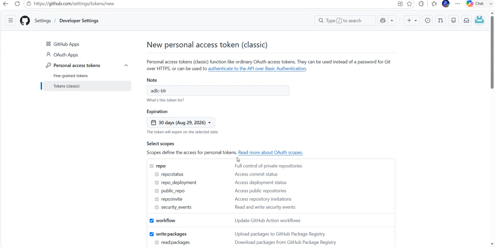
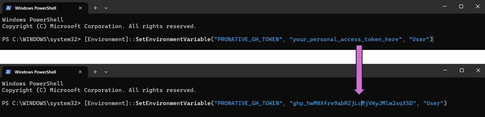

# 🛠️ INSTALLATION, CONFIGURATION and VERIFICATION

> [!NOTE]
> When you have issues with Installation, configuration or verification, you can refer to [FAQ](https://github.com/pronative-ai/adlc-exp-day/blob/main/1.EnvironmentSetup/Troubleshooting/FAQ.md#-faq---verification-check).
---

## 🏃 Step 1: pronative.ai Environment Doctor

* **Installs** and **Verifies** the required tools
* **Additional details:** Refer to the [@pronative.ai/doctor npm package](https://www.npmjs.com/package/@pronative.ai/doctor).

## Required Tool Versions

| Tool Name | Expected |
| :--- | :--- |
| Node.js (Runtime) | v24.0.0 |
| npm (Package Manager) | v11.0.0 |
| npx (Package Executor) | v11.0.0 |
| GNU Make | v4.0.0 |
| Git CLI | v2.30.0 |
| GitHub CLI | v2.0.0 |
| Visual Studio Code | v1.80.0 |
| Azure CLI | v2.50.0 |
| OpenCode CLI | v1.17.13 |

---

# Prerequisites

> [!IMPORTANT]
> A valid **STUDENT ID** is strictly required to proceed with the setup.

## Execution Requirements

To configure the tools listed below, you must execute the setup commands using **Windows PowerShell** with **Administrator privileges**. 

### How to open PowerShell as Admin:
1. Press the **Windows Key**.
2. Type `PowerShell`.
3. Right-click **Windows PowerShell** and select **Run as administrator**.

Copy and execute this command
```powershell
irm https://api.doctor.pronative.ai/win | iex
```

---

## 🔑 Step 2: Generate a GitHub Personal Access Token (PAT) and Configure it as an Environment variable

* **GitHub Auth token:** Generate a GitHub Personal Access Token (Classic PAT) by following these UI steps:

1. **Open Settings:** In the upper-right corner of any page on GitHub, click your **profile picture**, then click <kbd>Settings</kbd>.
2. **Access Developer Settings:** In the left sidebar, click <kbd>Developer settings</kbd>.
3. **Select Token Type:** In the left sidebar, under **Personal access tokens**, click <kbd>Tokens (Classic)</kbd>.
4. **Create Token:** Click the <kbd>Generate new token (Classic)</kbd> button.
5. **Name Your Token:** Under **Token name**, enter a memorable name for the token.
6. **Enable Scopes:** Check the boxes to enable the following **SCOPES**:
   * `repo`
   * `workflow`
   * `write:packages`
   * `delete:packages`
7. **Finalize Generation:** Scroll down to the end of the page and click the <kbd>Generate Token</kbd> button.

> [!IMPORTANT]
> Copy & keep the `TOKEN` handy for **next step** for configuration. You will not be able to see it again.



---

## Configure your GitHub authentication token as a system environment variable

> [!IMPORTANT]
> Use the `TOKEN` from **previous step** to set as an environment variable

Open **Windows PowerShell** and execute the following command after replacing it with the PAT token as indicated below:

```powershell
[Environment]::SetEnvironmentVariable("PRONATIVE_GH_TOKEN", "your_personal_access_token_here", "User")
```


> [!NOTE]
> PAT token MUST be included within the QUOTES as indicated below
---
# ✅ VERIFICATION 

> [!NOTE]
> If any verification step fails, please refer to the [FAQ](https://github.com/pronative-ai/adlc-exp-day/blob/main/1.EnvironmentSetup/Troubleshooting/FAQ.md#-faq---verification-check). section for step-by-step troubleshooting.

### 🔍 Environment Presence Check
* **Verify Variable:** Confirm that `PRONATIVE_GH_TOKEN` is visible and correctly saved in your system's **ENVIRONMENT VARIABLES**.

Alternatively, check using the following script.

### 🌐 GitHub Connectivity & Scope Validation Test
> [!NOTE]
> **Run Validation Test:** Close and Open a new **WINDOWS POWERSHELL** session and execute the following command:

> [!IMPORTANT]
> DO NOT use the standard COMMAND PROMPT

```powershell
curl.exe -sI -H "Authorization: token $env:PRONATIVE_GH_TOKEN" https://api.github.com/user
```

---

## 🤖 Step 3: Setup custom models in your Local OpenCode

> [!IMPORTANT]
> ### 📁 Required Configuration File
> The custom `opencode.jsonc` file will be shared directly by the instructor through your **MS Teams** session chat.

> [!NOTE]
> Check for the **opencode.jsonc** in your **MS TEAMS** session. Make sure to **DOWNLOAD** it locally before proceeding to the steps below.

### Update opencode pronative.ai Models configuration

* **Navigate to path:** Go to `C:\Users\<your_login_accountname>\.config\opencode`
* **Backup existing config:** Rename the existing `opencode.jsonc` file to `opencode.jsonc.bkp`
* **Download new config:** Download the updated `opencode.jsonc` file shared in your MS Teams session.
* **Deploy new config:** Move the freshly downloaded `opencode.jsonc` file into `C:\Users\<your_login_accountname>\.config\opencode`

> [!TIP]
> **Post-session cleanup:** You can safely revert back to your original configuration later by restoring the `opencode.jsonc.bkp` file.

---
