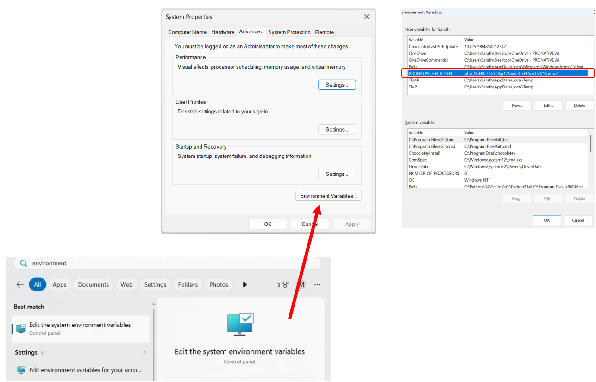

# ❓ FAQ - Verification Check

## 🔍 Step 1: Environment Presence Check

* **System Requirement:** Before writing code or creating directories, you must actively check for the presence of the system environment variable named `PRONATIVE_GH_TOKEN`.

> [!CAUTION]
> ### 🛑 Failure State
> If `PRONATIVE_GH_TOKEN` is missing, empty, or undefined in the current system environment, stop execution immediately and print:
> 
> `"Error: PRONATIVE_GH_TOKEN environment variable is missing or undefined. Please configure it in your system environment variables, restart your terminal session, and try again."`



---

## 🌐 Step 2: GitHub Connectivity & Scope Validation Test

* **System Requirement:** Once the variable is found, you must test its validity and verify that the necessary authorization scopes (`repo`, `workflow`, `write:packages`, `delete:packages`) are active. 
* **Validation Method:** Fetch the HTTP response headers by querying the GitHub user endpoint.

### 💻 Command to Run
```powershell
curl -sI -H "Authorization: token \$env:PRONATIVE_GH_TOKEN" https://api.github.com/user
```

* **Scope Verification Logic:** Inspect the `X-OAuth-Scopes` response header. You must scan the comma-separated text string to confirm that `repo`, `workflow`, `write:packages`, and `delete:packages` are explicitly present.

> [!CAUTION]
> ### 🔒 Failure State (Authentication Failure)
> If the response returns a `401 Unauthorized` status, stop execution and print:
> 
> `"Error: GitHub authentication failed. The token provided in PRONATIVE_GH_TOKEN is invalid or expired."`

> [!WARNING]
> ### 🔑 Failure State (Insufficient Privileges)
> If the connection succeeds but the `X-OAuth-Scopes` header is missing any of the required scopes (`repo`, `workflow`, `write:packages`, `delete:packages`), stop execution immediately and print:
> 
> `"Error: Insufficient token scopes. The provided token lacks required permissions. Please ensure 'repo', 'workflow', 'write:packages','delete:packages' scopes are explicitly enabled on your GitHub Personal Access Token settings and try again."`

---

> [!NOTE]
> ### 🎉 Success State
> If the environment variable is present, authentication returns `200 OK`, and all required scopes are verified, you may proceed to Stage 1. Use this token across all subsequent Git tasks and GitHub API activities.
