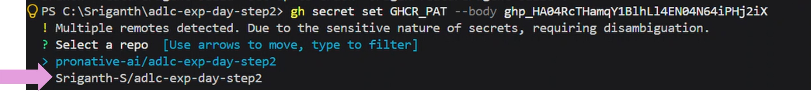

# # STEP 2 - Agentic DevOps (Outer loop) Playbook

---
### 🔐 Step 1: Secrets (GitHub Actions > Secrets)

These must be added manually:

| Secret | Description |
| :--- | :--- |
| **`GHCR_PAT`** | GitHub classic PAT generated earlier |
| **`CLIENT_SECRET`** | Service principal secret (for Azure auth will be shared by Presenter) |

**(or)**
> [!IMPORTANT]
> Use Terminal in VS Code to execute the following

### ⚠️ GitHub PAT Token

> [!TIP]
> If you do not remember where your stored the PAT then go to Environment Variable settings to find "PRONATIVE_GH_TOKEN"

```sh
gh secret set GHCR_PAT --body <generated-earlier>
```
> [!IMPORTANT]
> Select your personal REPO as indicated below



### ⚠️ Azure Client Secret

> [!IMPORTANT]
> Client secret will be shared in the MS Teams session

```sh
gh secret set CLIENT_SECRET --body <client-secret>
```

> [!IMPORTANT]
> Copy and Paste the PAT & Client Secret as is and do not leave space which can affect the deployment process


---

### ⚙️ Step 2: Run script to create variables required for outerloop:

* Follow instructions `env.example` in root folder to save `.env`
* Navigate to `scripts` folder from VS Code terminal

* Copy & Paste to execute the following:
```sh
./Initialize-GitHubVariables.ps1
```
---

## 🚀 Triggering the Outer loop

### 🔁 Step 1: Create pull request from feature branch to main branch in GitHub

This will trigger the CI (Continuous Integration) in your GitHub repo.

> [!TIP]
> Code review agent will review the code provide comments in pull request description.

> [!TIP]
> Critic Agent will review the code review agent's analysis and provide its analysis.

The CI's run can be viewed from GitHub repo's actions.

```bash
# Create the Pull Request via GitHub CLI
gh pr create \
  --title "Feat: Implement architecture plan from spec.md" \
  --body "Triggering Outer Loop CI. Code Review Agent and Critic Agent please analyze." \
  --base main \
  --head feature/agent-build
```

### 🔀 Step 2: Merge the pull request created in previous step

This will trigger the CD (Continuous Delivery) in GitHub.
> [!TIP]
> CD run can be viewed from GitHub repo's actions.

The CD run will build both frontend and backend.
Prepare docker containers and push to registry, then it will deploy to the azure container app.
Refer GitHub Action run's summary.

> [!TIP]
> Azure Container App URL can be found here

Use it in the browser to view the frontend application UI.

## 🏁 Concludes OUTER LOOP
